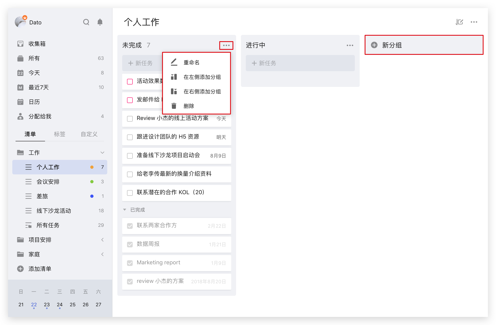
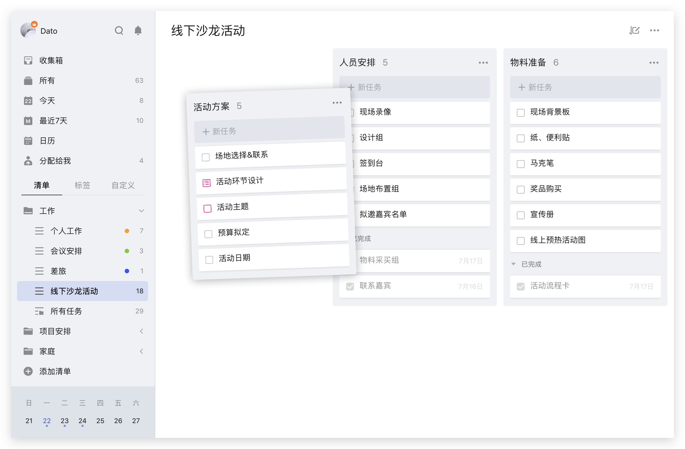
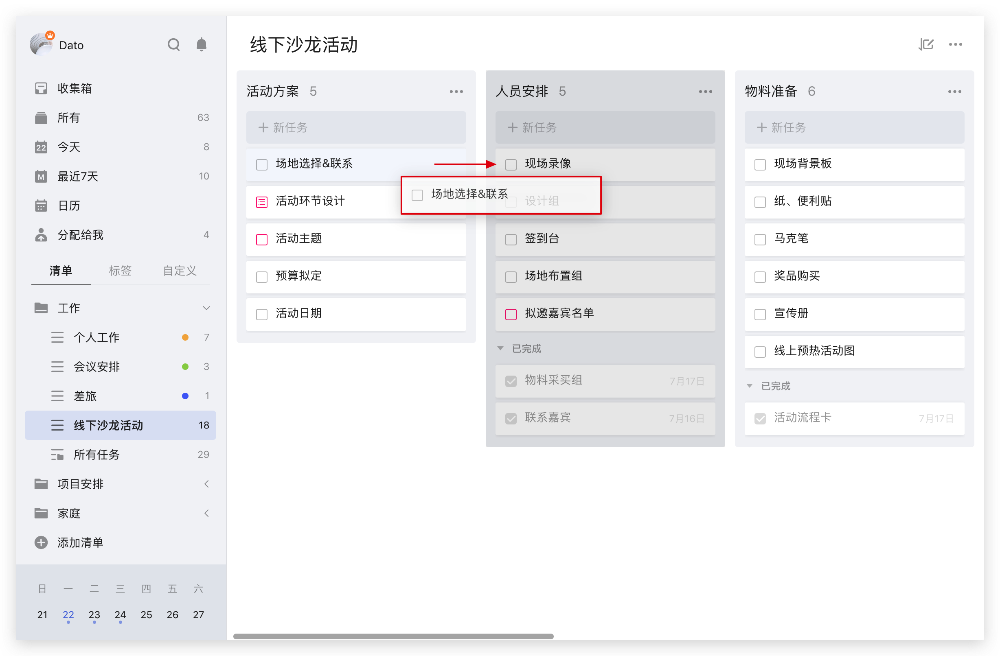
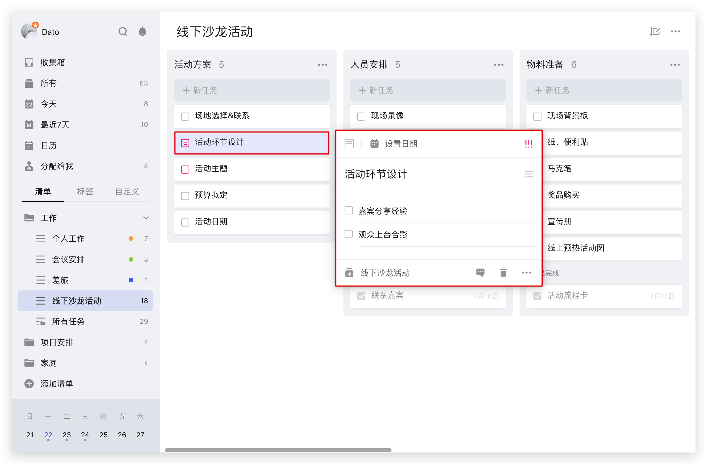
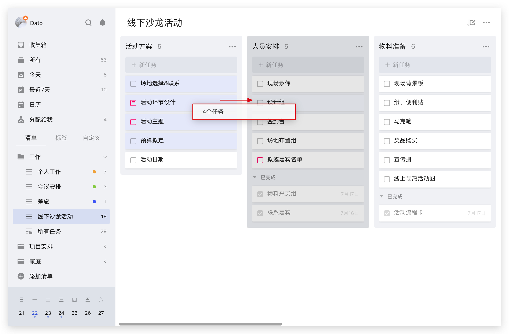

### 看板模式

#### 切换到看板模式

在**普通清单**的任务列表页，点击右上角的「···」，选择「看板模式」。

切换到看板模式后，会有两个默认的分组：

* 「未完成」：还未完成的任务会在这里。
* 「进行中」：子任务未全部完成的任务会默认出现在这里。（也可以将任意任务拖拽至该分组下。）

#### 编辑分组

点击每个分组右上角的「···」，即可**重命名**、**删除**该分组，或者在该分组左侧、右侧**添加分组**。
点击看板最右侧的「新分组」，即可在看板最右侧添加新分组。

#### 拖动排序

鼠标左键长按任意分组拖动，即可调整排序。

鼠标左键长按任意任务拖动，即可调整任务在该分组的顺序，或者拖动至其他分组。

#### 查看任务详情

点击任意任务，即可在弹窗中查看任务详情，对任务进行**修改任务日期与时间**、**优先级**、**所属清单**等操作。

#### 批量操作

点击任意任务，按住 Ctrl 键 ( Mac 上为 Command 键)，即可同时选中多个任务；
或者点击任务，按住 Shift，再点击另一个任务，即可选中两个任务之间的所有任务。

批量勾选任务后，在选中区，右键单击，即可批量修改任务的**日期**、**优先级**、**所属清单**、**标签**，或者**合并**、**删除**所有任务。

批量勾选任务后，在选中区，鼠标左键长按拖动，即可批量移动所有任务在分组内的位置，或者移动至其他分组。

