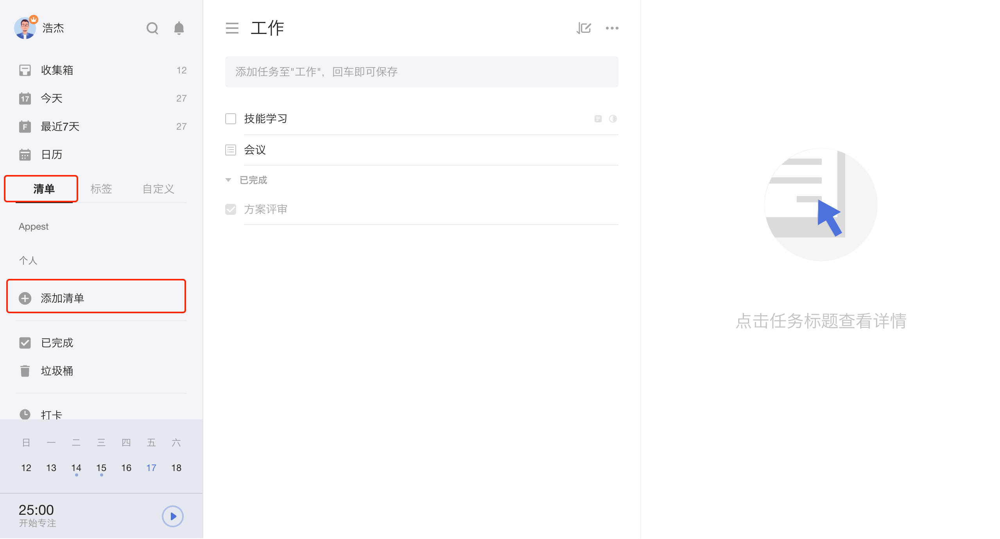
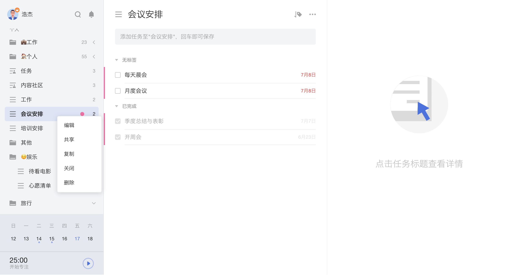

## 创建与管理清单

### 新建清单

点击页面左侧边栏的「添加清单」按钮，在弹窗中输入清单名称即可创建一个清单。

您也可以设置清单的名称、颜色、所属文件夹及显示/隐藏。

`注：开启「隐藏」开关后，该清单中的任务将不会在智能清单中显示，但任务到期时依然会提醒。`

### 文件夹

随着清单数量越来越多，可以使用文件夹来整理您的清单。
（例如，您可以创建购物文件夹，将超市购物清单、商场购物单、网购清单等放入其中）。

* **创建文件夹**：长按清单与另一清单重叠，在弹窗内输入文件夹名称即可创建清单文件夹。或者在清单编辑界面中创建文件夹。 

* 在清单列表可以直接拖动清单到文件夹，也可以将清单移出文件夹。

* **编辑文件夹**：在左侧边栏中，右键需要编辑的文件夹，即可对文件夹名进行修改。

* **解散文件夹**：在左侧边栏中，右键相应文件夹选择解散。 解散文件夹不会删除文件夹中的清单，其中的清单会独立出来显示在左侧边栏。
	

### 管理清单

右键单击清单，可以对清单进行「编辑」「共享」「复制」「关闭」「删除」的操作。

#### 编辑清单

单击「编辑」，可以改变清单名称、颜色以及显示/隐藏状态。

隐藏后，该清单的任务将不会出现在「所有」「今天」「最近七天」等智能清单中，但到期仍会提醒。

#### 共享清单

单击「共享」，或点击任务界面上方的「···」图标选择「共享」即可与他人进行清单共享，支持以下两种方式进行共享邀请：

* 1.邮箱邀请：输入受邀请人的电子邮箱地址即可发送邀请；
* 2.链接邀请：创建共享链接并发送给好友进行邀请。

共享清单中的任务可以指派给参与共享的成员。 选中某条任务，点击右侧任务详情页右上角的「指派」按钮，即可选择指派人。 更多详情参见[1.11 共享协作](../ios_app/5_share_lists.md) 。

#### 复制清单

点击「复制」，即可创建清单的副本。

副本会复制原清单内的所有任务。任务的列表排序、内容、日期、优先级、附件将保持与原清单一致。但是，原清单的评论和隐藏状态不可复制，已完成的任务和检查事项也将会变成未完成状态。
`注：共享清单复制后的副本是普通清单。`

#### 关闭清单

点击「关闭」即可关闭清单，关闭清单中的任务将不会再进行提醒。 关闭的清单可以在已关闭的清单中重新开启。

### 清单排序

普通清单、智能清单和自定义智能清单可以在左侧边栏中直接拖动进行排序。

### 清单动态

选中一个清单，点击任务列表界面上方的「···」-「清单动态」，可以在右侧查看清单中添加、删除、移动、完成、取消完成任务的动态。

### 打印清单

选中一个清单，点击任务界面上方的「···」-「打印」，可以选择打印标题或标题和内容。

