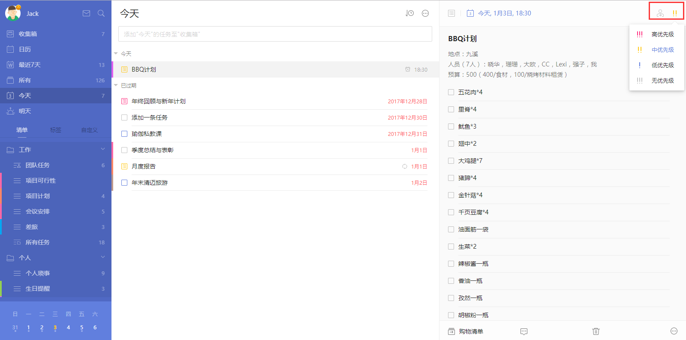
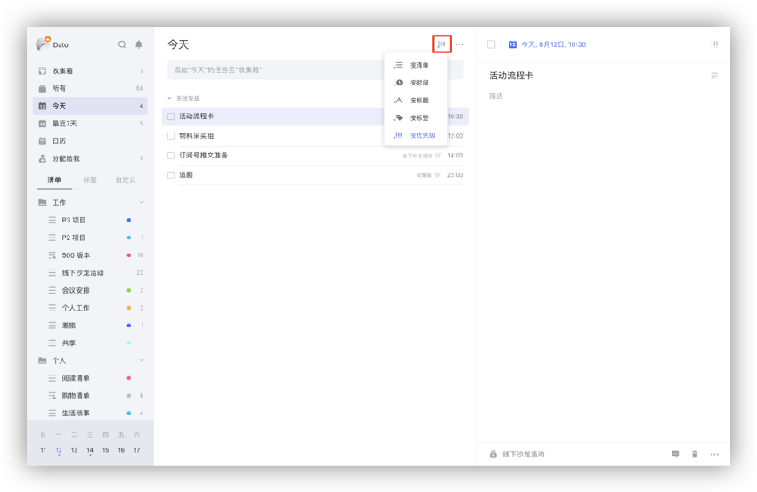
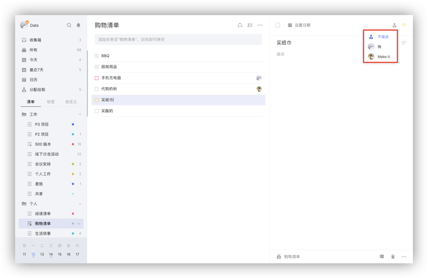
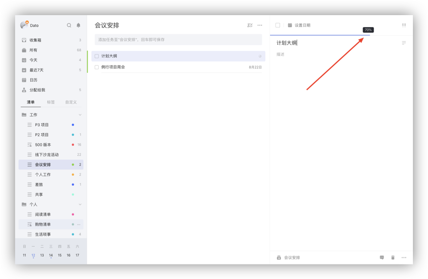
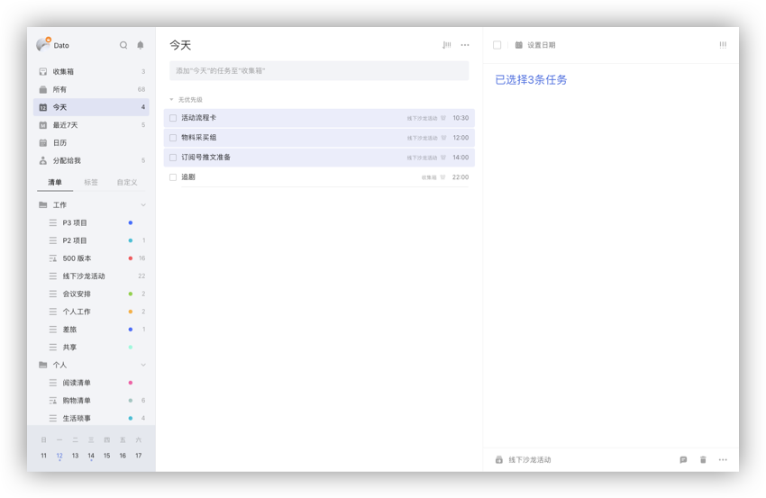
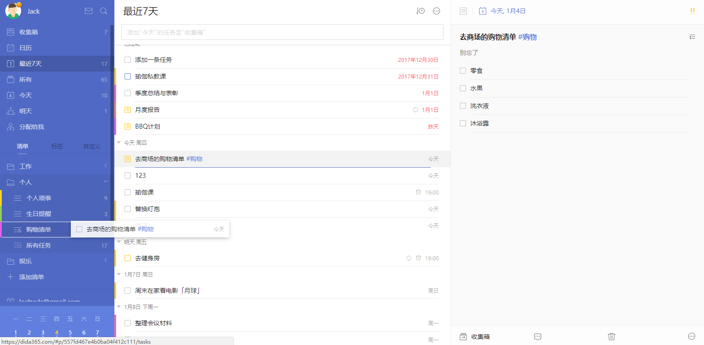

## 管理任务

#### 修改任务

任务的时间产生变更，或内容需要更改，可以直接在右侧任务详情页进行编辑。

任务详情页右上角，分别有「指派」和「优先级」按钮：

* 「指派」：可以将该任务指派给共享清单中的成员，包括自己；
   `注：该任务不属于共享清单时，不显示「指派」按钮。`
* 「优先级」：包括「高」「中」「低」「无」四种优先级。

 任务详情页下端，分别有「所属清单」「评论」「垃圾桶」「更多」。

* 点击「所属清单」，可以快速将任务移动到某个清单；
* 点击「评论」，可以对任务增加评论；若是共享任务，还可以@他人或回复他人，对方会在通知中心收到提醒；
* 点击「垃圾桶」，任务会被删除，若误删，可以点击弹出的提示中「撤销」按钮来恢复任务，也可以去侧边栏上的垃圾桶中恢复；
* 「更多」中包括：
   1、「标签」：为当前任务添加标签
   2、「上传附件」：滴答清单支持拍照、相册中的照片，音频和经常使用的文件类型如 word,excel 等。
    `注：免费用户一天可上传一个附件，高级账户一天可上传99个附件。`
   3、「任务动态」：你可以在这里看到此任务的历史动态，包括创建、修改、完成等。
    `注：「任务动态」为高级账户功能。`
   4、「打印」：可以将此任务的任务详情打印出来。

#### 给任务进行排序

滴答清单提供按自定义/清单排序、时间排序、标题排序、按标签、按优先级排序和按指派人排序。  「收集箱」以及所有您自己建立的普通清单都可以进行自定义排序，时间排序,，标题排序，优先级排序和按指派人排序。智能清单支持按清单排序。 `注：共享清单才会有按指派人排序。`

自定义排序下,可以拖动任务左侧的按钮进行排序（鼠标放置在任务完成框左端，自动出现按钮）。 清单排序，时间排序，优先级排序和按指派人排序下，拖动任务放到另外的区域中修改设置，比如任务可以从中优先级区域拖动放到高优先级区域，任务的优先级就修改成高优先级了。

在智能清单和自定义智能清单中，按时间排序下，任务、子任务和订阅的日历事件支持按时间混排，在“今天”等单天的区域内可以拖动任务左侧的按钮进行排序。 `注：「所有」、「今天」、「最近7天」等智能清单目前暂不支持自定义排序。`

#### 指派任务给其他人

你只能在与他人共享的清单里指派任务。  点击任务详情界面的指派图标，选择你要指派的对象。被指派者会在通知中心内收到通知。

#### 搜索任务

「搜索」的图标在左侧面板的顶部。利用搜索功能，可以对任务进行全局搜索。 `注：搜索结果包括已完成和未完成，可以自行设定搜索的条件：日期、清单和任务状态。`

#### 任务进度

进入任务详情页，光标放在日期栏上边缘，日期栏会显示进度条百分比，单击即可设定。任务打钩完成时，进度条会向右侧自动跳满。 如果是列表任务，会根据已完成子任务所占的比例自动计算任务进度。

#### 隐藏已完成的任务

如果想要更好的专注在未完成的任务中，可以选择「隐藏已完成」。 在任务列表页中，点击「...」,选择「隐藏已完成」。 需要时，也可以随时在「已完成」清单中查看已完成的任务，或者在右上角「更多」里点击「显示已完成」，将已完成任务再次显示出来。 `注：「已完成」是智能清单，需要在「设置」-「智能清单」中开启「已完成」清单后才能查看。`

#### 批量操作

当任务较多，且需要进行相同的设置操作时，可以通过批量操作来完成。

任务列表页上，按住「Ctrl 」或「Shfit 」键（Mac 端为「Command」），鼠标选中多条任务，然后右键进行批量操作。

可以批量完成/取消完成、修改日期、修改优先级、移动到其它清单、删除、指派给别人。若选中2个及以上任务，可以合并任务成新任务，新任务将以子任务形式呈现，但不再保留原任务的附件和评论信息，且原任务将被删除到垃圾箱。

`注：按住“SHIFT”键,选中第一条任务和最后一条任务，中间的所有任务会同时选中，适用于批量操作较多的任务。` `注：在普通清单中合并任务，新任务默认合并到该清单中；智能清单、自定义智能清单和所有清单中合并任务，默认合并到选中任务按自定义排序时的第一个任务的所属清单。`

#### 拖动任务到清单

拖动任务左侧的按钮，把任务拖到侧边栏上的清单中，放手后清单会移动到所选清单中。

拖动任务放到“今天”、“明天”、“最近7天”智能清单中，任务会带上对应的时间。比如昨天晚上9点的任务拖动到“今天”智能清单中，该任务的时间会变成今天晚上9点。

#### 快速操作

任务列表页上选中某条任务，右键可以快速设置时间、优先级、移动到别的清单、复制任务、删除任务、将共享清单中的任务指派给别人。

在任务详情页上，把鼠标悬停在日期栏的日历图标上，出现快速设置日期框，可以选择「今天」、「明天」、「下周」、「下月」，来快速修改日期。

#### 模板功能
可以点击「 头像 」 - 「 设置 」 - 「 模板 」，打开模板功能，当有常用的任务，不愿每次都重复添加一遍时，可以将它设置为「 模板 」。

可以将常用的任务直接设置为模板。

之后则可以从模板中选择自己想要的模板。

