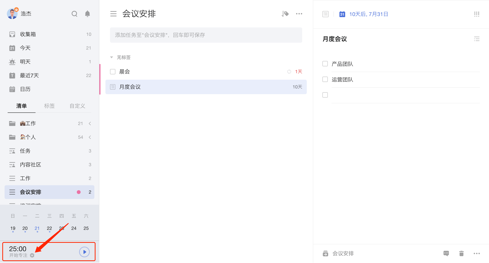

## 设置专注计时

### 开启番茄计时
如果您需要使用计时，请先开启「番茄计时」功能。在「设置」-「实验功能」中找到「番茄计时」，点击即可开启。

开启后，可在左侧边栏的底部可以看到番茄计时的小窗口。

### 番茄设置
如果您想要自定义番茄的各项设置，比如：每日目标番茄数、番茄时长，休息时长、长休息间隔番茄数、自动选项和番茄提示音。可以将鼠标移动到位于左侧边栏底部的番茄计时窗口上，点击出现在窗口右侧的「设置」按钮，即可对番茄计时进行设置。
