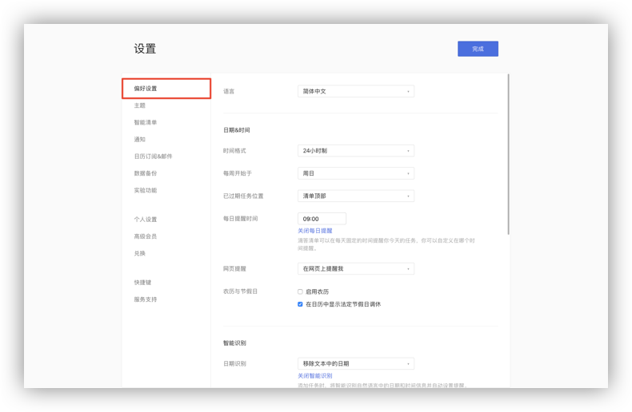
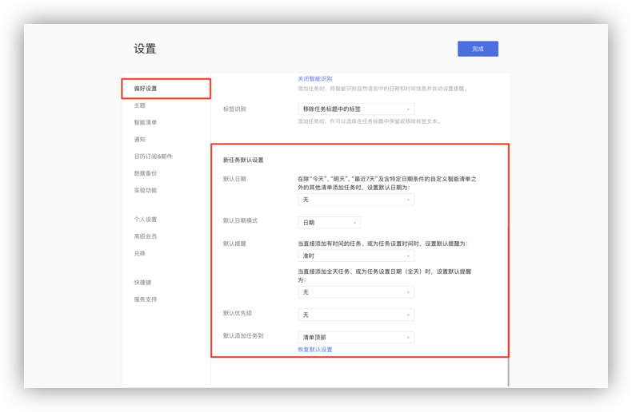
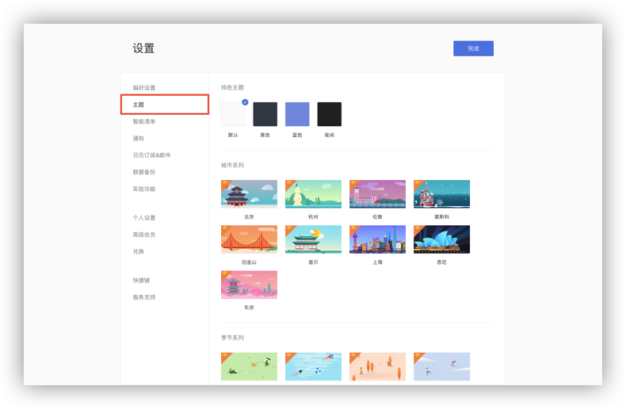

## 设置

### 偏好设置

点击左上角头像-「设置」-「偏好设置」，可以根据你的使用偏好来对语言、日期&时间、智能识别和新任务默认设置等进行设置。

**语言**
* 语言：下拉框选择语言；

**日期&时间**
* 时间格式：可以选择12小时制/24小时制；

* 每周开始于：日历中的每周开始日期，支持周日/周一/周六；

* 已过期任务位置：可以选择放在清单顶部或清单底部；

* 每日提醒时间：打开每日提醒开关后，可以自行设定每一天的提醒时间；  `注 ：如果在上午9:00设置为“每日提醒时间”，所有逾期和今天任务将在上午9点提醒。`
	
* 网页提醒：可以选择在多平台同时使用时，任务提醒在网页端不提示；

* 农历、周数、节假日：可以选择是否在日历中开启农历、周数和节假日；

* 倒数日模式：启用后，清单内各任务右侧的日期，将显示为倒数日，可以点击任务右侧的倒数日或日期进行切换；

* 时区：启用后，在时间选择界面设置时间时，可以选择时区；

**智能识别**

* 日期识别：添加任务时，将智能识别自然语言中的日期和时间信息并自动设置提醒。

* 标签识别：添加任务时，你可以选择在任务标题中保留或移除标签文本。

**新任务默认设置**

您可以根据需要对新任务的日期、日期模式、提醒、优先级和添加到清单的位置进行默认设置，之后添加的新任务会自动带上这些默认设置。
   `注：智能清单“今天”、“明天”、“最近7天”、日历以及带日期的自定义智能清单不受默认日期的影响。`

### 主题

点击左上角头像-「设置」-「主题」，滴答网页版提供了4种纯色主题，12种城市系列主题和4种季节系列主题，可以根据喜好选择主题，设置使用。 `注：城市和季节主题都是高级账号功能。`

### 模板
开启后，你可以进入任务详情，点击右下角「···」菜单，将任务保存为模板。以后添加任务时即可选择从模板添加。

### 通知

你可以选择在所有共享清单内默认接收**完成/取消完成了任务**、**添加了任务**和**删除/移走了任务**的通知。若你手动更改过某个特定共享清单的通知类型，那么此默认设置将不再对已更改的共享清单生效。

### 数据备份

#### 备份与还原

可以生成备份数据，将所有的清单、任务、子任务、文本、提醒等生成备份。

点击「从TickTick导入」可以导入TickTick帐号中的数据。

#### 导入其他应用程序数据

可以从Todoist、Microsoft Todo、Wunderlist、OmniFocus、Toodledo、iCal等应用程序中导入程序备份。

### 实验功能

#### 复制任务

打开「复制任务」功能后，可以鼠标右键对所选任务进行复制。

#### Mini日历

打开「Mini日历」后，可以在主页左下角看到Mini日历，可以通过日历快速查看日程。

#### 番茄计时

打开「番茄计时」后，可以在主页左下角显示**开始专注**小窗口。

#### 打卡

打开「打卡」后，当左侧边栏底部显示**打卡**按钮。点击「打卡」可以进入打卡界面。

### 日历订阅&邮件

#### 订阅日历
 滴答清单允许您从其他日历服务中订阅事件。在订阅日历界面，点击「添加日历」，可以选择谷歌日历订阅和通过URL订阅日历。
	**同步谷歌日历**：登录谷歌账号，允许滴答清单订阅谷歌日历，即可完成订阅。 
	**通过URL地址订阅日历**：输入你想订阅日历的URL，即可完成订阅。

#### 在其他日历应用中订阅滴答清单

可以将滴答清单的URL链接添加到Google Calendar, Outlook等日历应用。

#### 通过邮件创建任务

