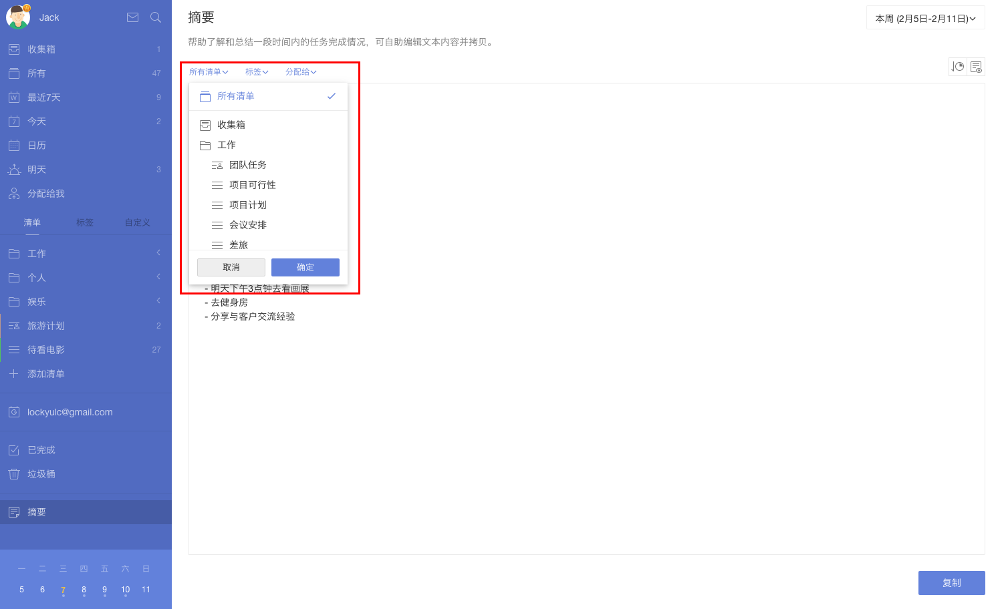
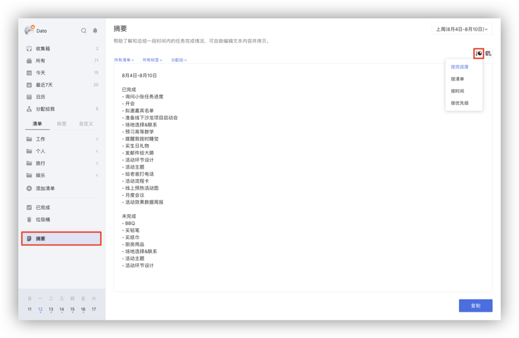
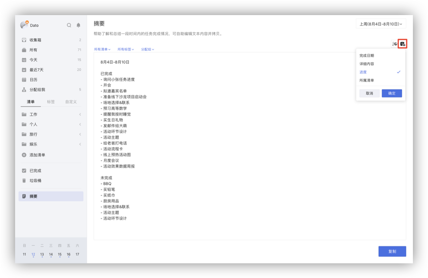

## 摘要

帮助您了解和总结一段时间内的任务完成情况，可自助编辑文本内容并拷贝。

### 筛选任务

您可以在摘要中点击「所有清单」来选择某一具体清单的摘要内容。

点击「所有标签」可以选择带有该标签的摘要内容。

点击「分配给」可以选择分配给我/他人，或者未分配的任务摘要内容。

### 时间区间

在摘要界面的右上角，点击按钮可以选择您想看的一段时间内的摘要内容，也可以通过点击自定义设置您想要的时间区间。

### 内容与分类

当您需要以特定的分类显示摘要内容时，可以点击摘要内容模块的右上角按钮，来选择「按完成度」、「按清单」、「按时间」的格式显示摘要内容。

您也可以点击旁边的按钮，选择摘要中是否显示任务的「完成日期」、「详细内容」、「进度」、「所属清单」。

