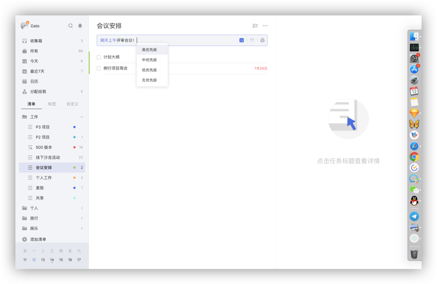
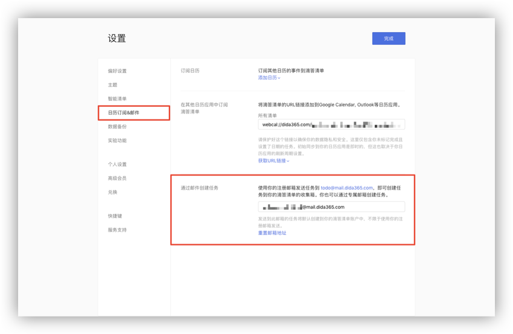
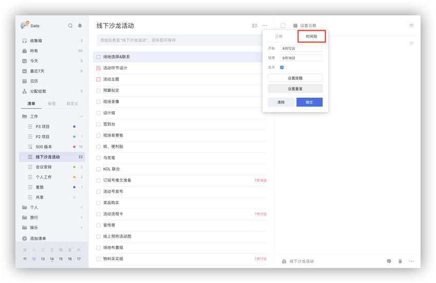
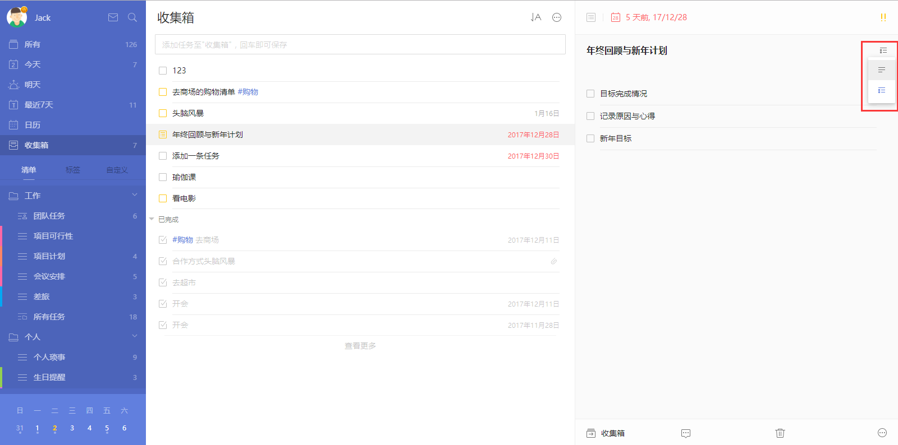
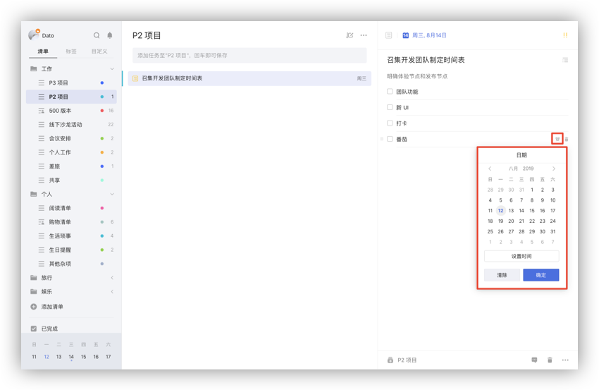

## 创建任务

### 任务添加栏添加任务

在任务列表页顶部的任务添加栏输入任务内容, 按回车键即创建成功。 在清单中创建任务会保存在当前清单中；在智能清单中添加任务，若没有选中清单,则任务默认保存在「收集箱」中。

* 在输入栏内输入「#」，可以为任务指定标签；
* 在输入栏内输入「^」，可以将任务添加到指定清单；
* 在输入栏内输入「*」，可以快速为添加的任务设置日期；
* 智能识别日期：在输入栏内输入任务，文本中的日期和时间显示高亮，将自动为任务设定到期日和提醒时间。
*   `注：进入「设置」-「偏好设置」-「智能识别」-「日期识别」即可开启智能识别日期。`
   `注：不想显示文本中的日期和时间，可在「设置」-「偏好设置」-「智能识别」-「日期识别」下选择「移除文本中的日期」。点击高亮的识别日期也可以取消识别。在添加时会把新任务默认设置带上，根据自己的需要在「设置」-「偏好设置」-「新任务默认设置」中进行设置。`

### 快速添加任务

可以使用快捷键调出任务添加栏，快速添加任务。创建任务的快捷键可以查看头像-「设置」-「快捷键」。

### 回车添加任务

在任务列表页上，选中某条任务，光标定位在任务最后，键盘点击回车，输入任务标题可以创建新任务。在已完成中回车可以创建新的已完成任务。

不同排序下回车创建的任务带上的设置不同。比如：在按时间排序下，“今天”清单下中回车创建的任务会带上今天的时间。

### 批量添加任务

把多行（含回车换行）的文本复制粘贴到添加栏时，会弹窗提示是否需要同时添加多个任务，选择「添加」会同时添加多个任务到该清单；选择「取消」，每一行的文字会以空格间隔形成一个任务标题，可回车添加。

比如复制的文本如下： 和同学聚餐 看电影 晚上8点去图书馆

复制粘贴到添加栏时，选择批量添加任务，该清单中就添加了三条任务。 `注:智能识别开启，若批量添加的任务标题中含有时间信息也会被识别。`

### 通过邮件添加任务

除了直接在网页端添加任务，你也可以通过邮件创建任务。  点击左上角头像-「设置」-「日历订阅&邮件」,使用您在滴答清单上注册的邮箱，直接将任务发送至 [todo@mail.dida365.com](todo@mail.dida365.com) ， 任务即自动生成。  同时可以在邮件标题中加入时间信息如X月X日，来快速设定任务到期时间。  点击左上角头像-「设置」-「日历订阅&邮件」，您也可以查看系统自动生成的专属邮件地址, 您只需要直接在邮件标题中将任务内容写入, 通过任意邮箱发送到该地址, 任务便会自动创建。

点击重置, 会生成一个新的邮件地址。

### 时间段任务

有些事情10分钟以内就能搞定，但有些事情需要持续1小时甚至几天。在日期选择框中切换到「时间段」，可以选择开始时间和结束时间，设置跨天的任务。跨天任务也可以设置提醒，提醒是根据开始时间设置的。 在任务列表的添加栏中，可以识别时间段，比如“2/19-2/22 旅游”，时间段信息是可以识别的。

### 创建列表任务

成功创建任务后，右侧任务详情界面，点击任务右侧的「文本」按钮，可以将文本模式转为列表模式。 列表任务一般用来添加子任务，如购物清单；也可以将大任务拆分成小任务或具体步骤。 回车即可添加下一条子任务，可以对子任务进行修改，回退删除和点击后面的垃圾桶图标进行删除。

### 子任务描述

列表任务时，任务描述可以和子任务共存，描述可以记录备注，方便了解当前事件的状况。

### 子任务提醒

列表任务中，可以给每个子任务设置提醒，明确每一个执行步骤的截止日期，不错过任何小事件。

`注：该功能为高级账户功能。`

有时间的子任务提醒时间就是所设置的时间，只有日期没有时间的子任务的提醒时间是根据每日提醒的时间提醒。

有时间信息的子任务会显示在今天、明天、最近7天、日历和带有时间的自定义智能清单中。子任务默认是隐藏的，需要开启时，点击任务列表页面右上角的「···」，选择「显示子任务」，子任务就会显示在列表中。按时间排序时，子任务、任务和日历事件是根据时间混排的。

