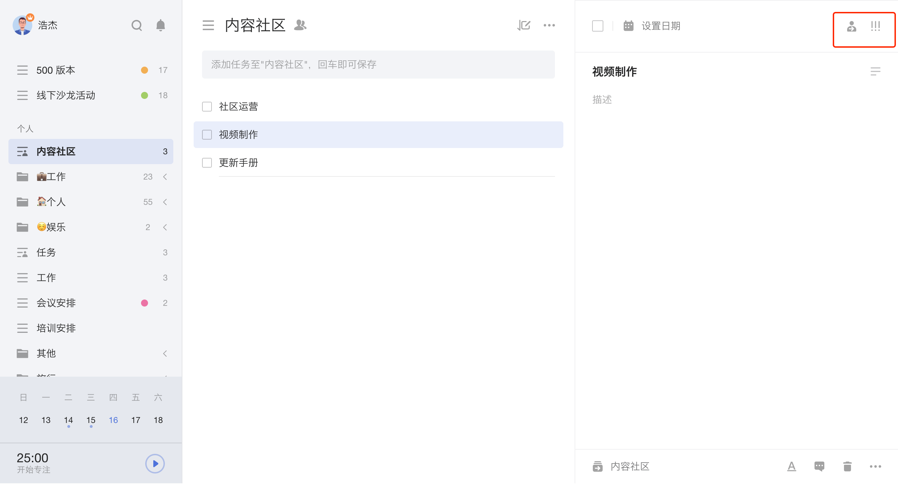
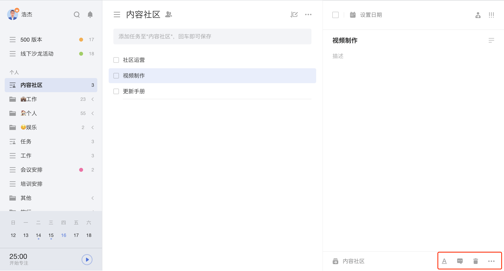
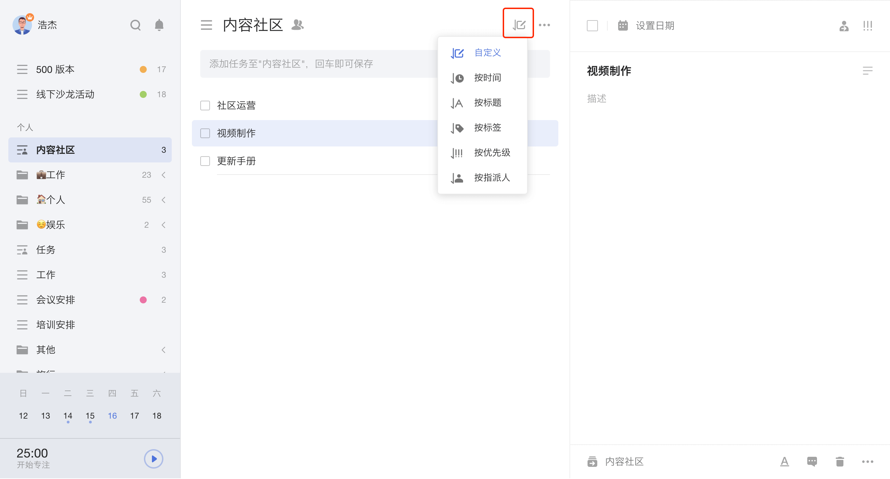
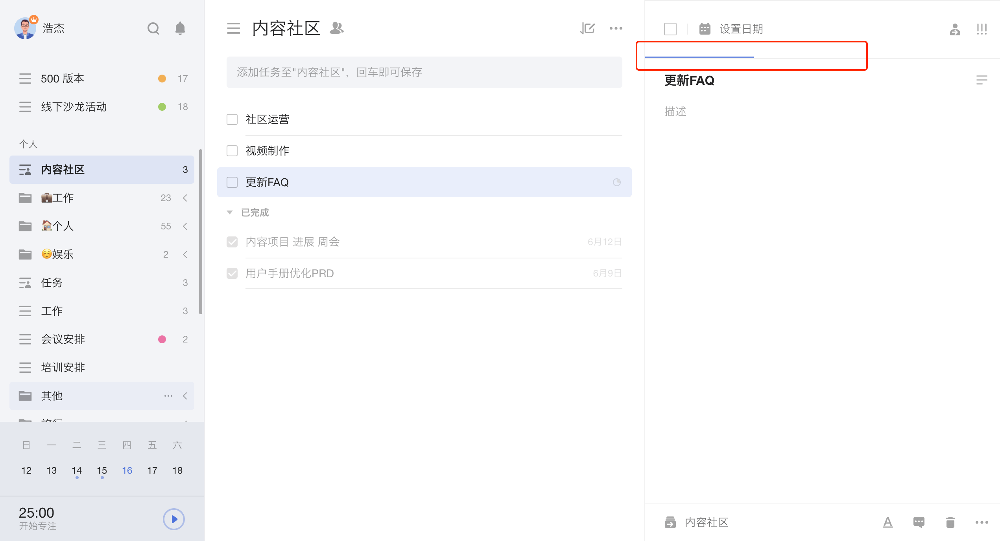

## 管理任务

### 修改任务

您可以直接在右侧任务详情页编辑和修改任务标题、内容、日期和时间、优先级等。

任务详情页右上角，分别有「指派」和「优先级」按钮：

* 「指派」：可以将该任务指派给共享清单中的成员，包括自己；
   `注：该任务不是共享清单，则不会显示「指派」按钮。`
* 「优先级」：包括「高」「中」「低」「无」四种优先级。

 任务详情页下端，分别有**所属清单/文件夹**、**Markdown入口**、**评论**、**垃圾桶**、**更多**。

* **所属清单/文件夹**：可以快速将任务移动到某个清单或文件夹。
* **评论**：可以对任务添加评论，若是共享任务，可以@他人或回复他人，对方会在通知中心中收到提醒。
* **垃圾桶**：可以在垃圾桶中查看被删除的任务。若误删任务，可以前往左侧边栏中的垃圾桶恢复。
* **更多**包括：
   1、「标签」：可为当前任务添加标签；
	 2、「开始专注」：点击即可开始该任务的专注计时；
   3、「上传附件」：滴答清单支持图片、音频和各种类型文件的上传；
   4、「任务动态」：您可以在此处查看任务的历史动态，包括创建、修改、完成和取消完成等；
	 5、「复制任务」：点击可以生成任务副本；
   `注：需要前往「设置」-「实验功能」中将「复制任务」开启，「复制任务」按钮才会显示。`
	 6、「复制任务链接」：点击可以复制该任务的链接；
	 7、「保存为模板」：任务的内容、标签会被完整保存地为模板，但日期时间、提醒、优先级、评论、附件等信息不会被保存到模板中。
   8、「打印」：可以将此任务的任务详情进行打印。

### 给任务进行排序

滴答清单提供自定义、按时间、按标题、按标签、按优先级、按指派人和按清单等排序方式。

* **自定义排序**：该排序模式下，长按任务进行拖动即可自定义排序。
* **按时间排序**：该排序模式下，任务将按「已过期」「今天」「最近7天」「更远」区分排序。
* **按标题排序**：该排序模式下，任务将按标题的首字母排序。
* **按标签排序**：该排序模式下，任务将按所携带的标签进行排序。
* **按优先级排序**：该排序模式下，任务将按高、中、低、无优先级四个等级排序。长按拖动任务从一个等级区域到另一个等级区域，将自动更改任务的优先级。
* **按指派人排序**：在共享清单中支持按指派人排序。
* **按清单排序**：在智能清单和文件夹中支持按清单排序。

### 指派任务给其他人

您可以在共享清单里指派任务。点击任务详情界面右上角的指派图标，选择您要指派的对象，指派人将会在通知中心内收到通知。

### 搜索任务

「搜索」的图标在左侧边栏的顶部。利用搜索功能，可以对任务进行全局搜索。 搜索结果包括已完成和未完成，可以自行设定搜索的条件：日期、清单、标签和状态等。

### 隐藏已完成的任务

如果想要更好的专注在未完成的任务中，可以选择「隐藏已完成」。 在任务列表页中，点击右上角「···」-「隐藏已完成」即可隐藏已完成的任务。 

需要时，也可以随时在「已完成」清单中查看已完成的任务，或者在右上角「更多」里点击「显示已完成」，将已完成任务再次显示。 
`注：「已完成」是智能清单，在「设置」-「智能清单」中开启「已完成」后即可查看。`

### 批量操作

当任务较多，且需要进行相同的设置操作时，可以通过批量操作来完成。

任务列表页上，按住「Ctrl 」（ Mac 端为「Command」) 或「Shfit 」键，鼠标可选中多个任务，点击右键即可进行以下批量操作：

* 修改到期时间；
* 移动到其他清单；
* 删除；
* 设置优先级；
* 发送；
* 合并任务。

合并的多个任务将作为新建任务的检查事项。原有任务的附件和评论将被删除。

### 拖动任务到清单

您可以通过点击并拖动任务左侧的按钮，将任务拖到左侧边栏的清单中。

拖动任务至「今天」「明天」「最近7天」等智能清单时，任务的时间将会被设置成相应的日期。

### 快速操作

在任务列表页上选中某条任务，右键可以快速进行设置日期、设置优先级、移动到别的清单/文件夹、添加标签、开始专注、复制任务、复制任务链接、删除任务以及将共享清单中的任务指派给其他人的操作。

在任务详情页上，将鼠标悬停在日期栏的日历图标上时，将出现快速设置日期框，您可以选择「今天」「明天」「下周」「下月」，来快速修改日期。

### 任务进度

进入任务详情页，光标停留在日期栏的下边缘上会显示进度条百分比，点击即可设定。任务打勾完成时，进度条会向右侧自动跳满。 如果是列表子任务，会根据已完成子任务所占的比例自动计算任务进度。

### 任务动态

您可以在任务详情中查看任务动态，了解任务每一次改动的信息。进入任务详情页后，点击右下角「···」图标，点击「任务动态」即可查看任务动态。

### 模板功能
点击左上角头像， 选择「 设置 」-「 模板 」，启用模板功能，即可快速从模板添加任务和将任务保存为新模板。

在任务详情页，点击右下角「···」-「保存为模板」即可添加任务模板。

设置成功后，在任务添加栏添加任务时，可以点击任务添加栏最右侧下拉框按钮，选择「从模板添加」，为任务选择自己想要的模板。
