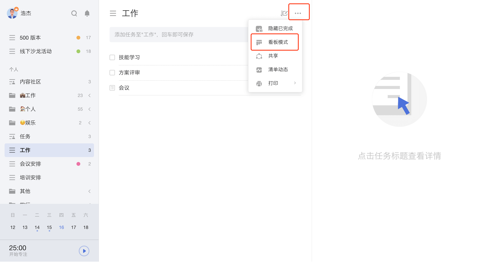

## 看板模式管理任务

### 看板模式

将清单从列表模式切换到看板模式后，任务将被自动分为**未完成**和**进行中**两个看板分组，您可以按自己的需求来创建新的分组。

### 列表模式和看板模式的切换

在**普通清单**的任务列表页，点击右上角的「···」，选择「看板模式」。

切换到看板模式后，会有两个默认的分组：

* 「未完成」：此处将显示未完成任务。
* 「进行中」：此处将显示正在进行的任务。

### 编辑分组

点击分组右上角「···」，即可对该分组进行**重命名**和**删除**，并可以选择在该分组左侧、右侧**添加分组**。
点击看板最右侧的**新分组**，即可添加新分组。

### 拖动排序

长按任务进行拖动，即可调整任务在该分组的排序。

### 查看任务详情

点击任务，即可在弹窗中查看任务详情，可以修改任务的**日期与时间**、**优先级**、**所属清单**等。

### 批量操作

点击任意任务，按住「Ctrl 」（ Mac 端为「Command」) 或「Shfit 」键，即可同时选中多个任务；点击任务，按住 Shift，再点击另一个任务，即可选中两个任务之间的所有任务。

批量勾选任务后，在选中区右键单击，即可批量修改任务的**日期**、**优先级**、**所属清单**、**标签**，或者**合并**、**删除**所有任务。

批量勾选任务后，在选中区左键长按拖动，即可批量移动所有任务在分组内的位置，或者移动至其他分组。