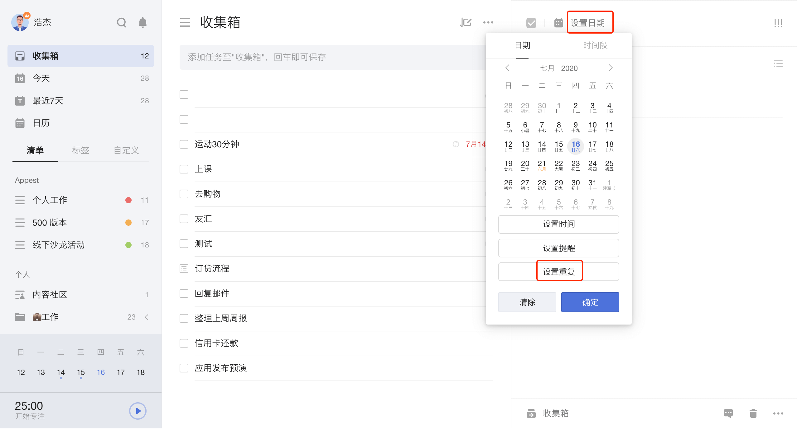
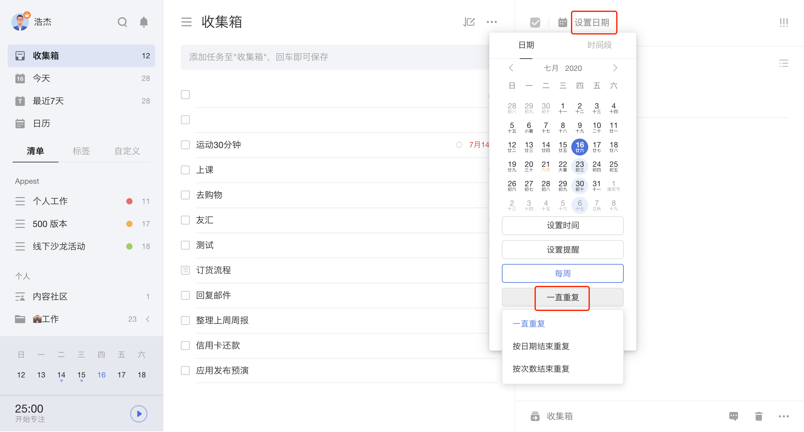

## 设置重复任务

### 常见重复

当任务重复出现时，可以将其设置为重复任务。

点击任务进入右侧详情页，点击顶部日期栏 - 「设置重复」，可以选择按每天/每周/每月/每年/法定工作日/艾宾浩斯记忆法等周期来重复。

`注：艾宾浩斯记忆法的重复周期按照1，2，4，7，15，15，15，15，15，15，15，15……循环。`

### 自定义重复

若默认重复中没有您需要的重复周期，您可以点击「自定义重复」，包括以下两种重复类型：

* **到期重复**：是指当前时间到达设置的时间就会提醒的重复，不会因为完成进度而变化。
  `例如：小明计划每周五13:00安排下周的工作，在设定每周五13：00的到期重复后，滴答清单将在每周五13:00及时发送提醒。`
* **完成重复**：是指上次任务完成后再开始计算下次提醒时间的重复，再次提醒的时间会因为自己所完成的时间而改变。
  `例如：小明计划每三天健身一次，当第一次健身是在周二时，第二次提醒将在周五进行。如果小明在周五取消计划，将其推至周六，那么在周六完成第二次健身计划后，第三次提醒将在周二进行，而不是在周一提醒。`

### 结束重复

重复任务默认一直重复。您可通过设置「按日期结束重复」和「按次数结束重复」来自动结束任务的重复。

* **按日期结束重复**：设置一个重复的截止日期，此日期之后不再重复创建此任务。
* 
* **按次数结束重复**：设置一个重复次数，到达该次数以后不再重复创建此任务。
