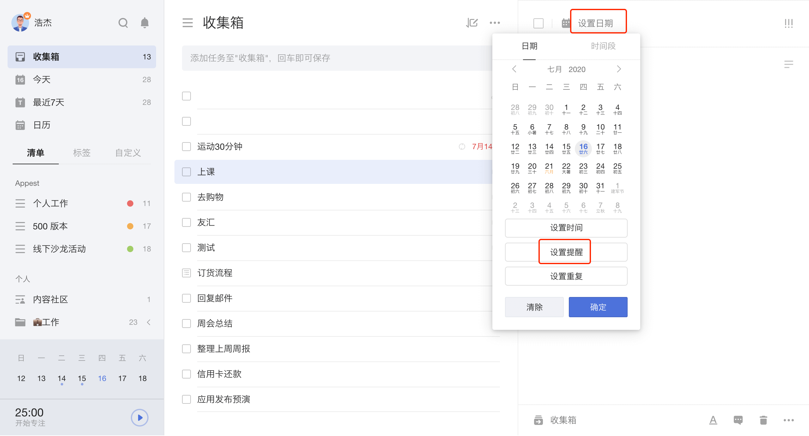

## 设置提醒

设置任务时间后，可以为任务设置提醒。 您可以点击任务进入右侧任务详情页，点击顶部日期栏 - 「设置提醒」，来为任务设置提醒时间。

如果担心一次提醒容易错过，您可以设置多次提醒。 若默认提醒中没有您需要的提醒时间，可点击「自定义」按钮，支持以「分钟」「小时」「天」为单位设置您所需要的提醒。 

### 为检查事项设置提醒

任务的每个检查事项均可设置提醒，帮助您明确每一个检查事项的执行时间。

### 清除任务提醒

若不需要任务提醒，您可以清除任务时间和提醒。 可以点击任务进入右侧详情页点击日期栏，选择「清除」即可，任务会清除到期日，也不再提醒。

