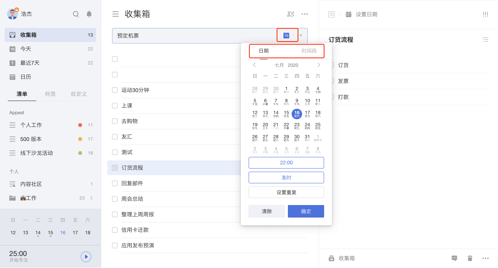
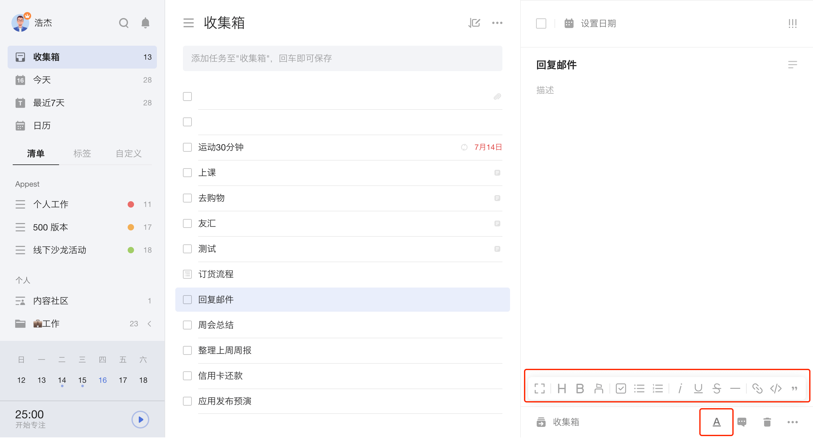

## 创建任务

### 任务添加栏添加任务

在任务列表页顶部的任务添加栏输入任务内容，按回车键即创建成功。 在普通清单中创建任务将会保存在当前清单中；在智能清单中添加任务，若未选中清单，则任务默认保存在「收集箱」中。

* **智能识别**
* 在输入栏内输入「#」，可以快速为任务指定标签；
* 在输入栏内输入「～」，可以快速将任务添加到指定清单；
* 在输入栏内输入「*」，可以快速为任务设置常用日期；
* 在输入栏内输入日期和时间，可快速为任务设定日期或时间段。  `注：进入「设置」-「偏好设置」-「智能识别」即可开启/关闭智能识别日期。`
* 取消识别：点击高亮部分，即可取消识别标签/清单/日期和时间，将识别部分变为普通文本。

#### 创建时间段任务

在日期选择框中切换到「时间段」，可以选择开始时间和结束时间，设置跨时间段任务。 在任务列表的添加栏中，也可以智能识别时间段信息。

跨天任务也可以设置提醒，提醒是根据开始时间设置的。

#### 创建检查事项

成功创建任务后，在任务详情界面点击任务标题右侧的切换检查事项按钮，可以将任务文本内容转为检查事项。 

回车即可添加下一条检查事项，也可以对检查事项进行修改，delete 删除或点击后面的垃圾桶图标可以删除检查事项。

#### 使用Markdown编辑任务描述

成功创建任务后，在右侧任务详情界面，点击Markdown入口「<u>A</u>」即可使用Markdown功能进行编辑。

该功能支持加标题、加粗、高亮、斜体、下划线、删除线、加备注、左右缩进等文本格式，还支持多种方式添加有序列表。不仅可以添加外部链接，还可以关联其他任务以便快速跳转。

### 快捷键添加任务

可以使用快捷键调出任务添加栏，快速添加任务。创建任务的快捷键可以查看头像 -「设置」-「快捷键」。

### 回车添加任务

在任务列表页中选中某条任务后，键盘回车后即可创建新任务。

### 批量添加任务

将多行的文本复制粘贴至任务添加栏时，将会出现“是否需要同时添加多个任务”的弹窗提示。选择「添加」后，多个任务将同时添加至该清单，并且自动识别批量添加任务标题中的时间信息。

### 微信创建任务

关注并绑定”滴答清单“微信公众号，可以通过微信公众号在滴答清单中创建任务。  更多相关的内容请参考 [玩转微信公众号](../wechat.md)。

### 通过邮件添加任务

除了直接在网页端添加任务，您也可以通过邮件创建任务。 

使用您的注册邮箱，将任务发送至todo@mail.dida365.com， 任务即自动生成。

点击左上角头像 -「设置」-「日历订阅&邮件」，您可以查看系统自动生成的专属邮件地址，您只需要在邮件标题中将任务内容写入，通过任意邮箱发送到该地址，任务便会自动创建。点击重置，可以生成一个新的邮件地址。

